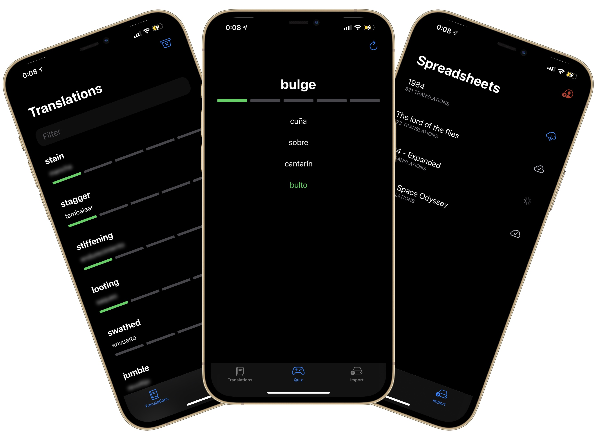

# MyVocabulary

This iOS app imports your Google Translate favorite translations to help you learn.

🛠️ **[Work in progress](https://serg-ios.github.io/2021-03-06-my-vocabulary/)** 🛠️

## Index

1. [Introduction](https://serg-ios.github.io/2021-03-06-my-vocabulary/#introduction)
2. [First steps](https://serg-ios.github.io/2021-03-06-my-vocabulary/#first-steps)
3. [Google Cloud Platform](https://serg-ios.github.io/2021-03-06-my-vocabulary/#google-cloud-platform)
4. [URL Types configuration](https://serg-ios.github.io/2021-03-06-my-vocabulary/#url-types-configuration)
5. [Google Sign In, SwiftUI implementation](https://serg-ios.github.io/2021-03-06-my-vocabulary/#google-sign-in-swiftui-implementation)
6. [Don't upload API Keys to Git](https://serg-ios.github.io/2021-03-06-my-vocabulary/#dont-upload-api-keys-to-git)
7. [Download spreadsheets from Google Drive](https://serg-ios.github.io/2021-03-06-my-vocabulary/#download-spreadsheets-from-google-drive)
8. [Parse spreadsheet's translations](https://serg-ios.github.io/2021-03-06-my-vocabulary/#parse-spreadsheets-translations)
9. [MVVM in SwiftUI](https://serg-ios.github.io/2021-03-06-my-vocabulary/#mvvm-in-swiftui)
10. [Core Data in background](https://serg-ios.github.io/2021-03-06-my-vocabulary/#core-data-in-background)
11. [Background and concurrent tasks in SwiftUI](https://serg-ios.github.io/2021-03-06-my-vocabulary/#background-and-concurrent-tasks-in-swiftui)
12. [Accessibility - Dynamic Type](https://serg-ios.github.io/2021-03-06-my-vocabulary/#accessibility)
13. [Accessibility - VoiceOver](https://serg-ios.github.io/2021-03-06-my-vocabulary/#voiceover)
14. [Internationalization and localization](https://serg-ios.github.io/2021-03-06-my-vocabulary/#internationalization-and-localization)
15. [Spotlight](https://serg-ios.github.io/2021-03-06-my-vocabulary/#spotlight)
17. [Widgets](https://serg-ios.github.io/2021-03-06-my-vocabulary/#widgets)
18. [Widgets - WidgetBundle](https://serg-ios.github.io/2021-03-06-my-vocabulary/#widgetbundle)
