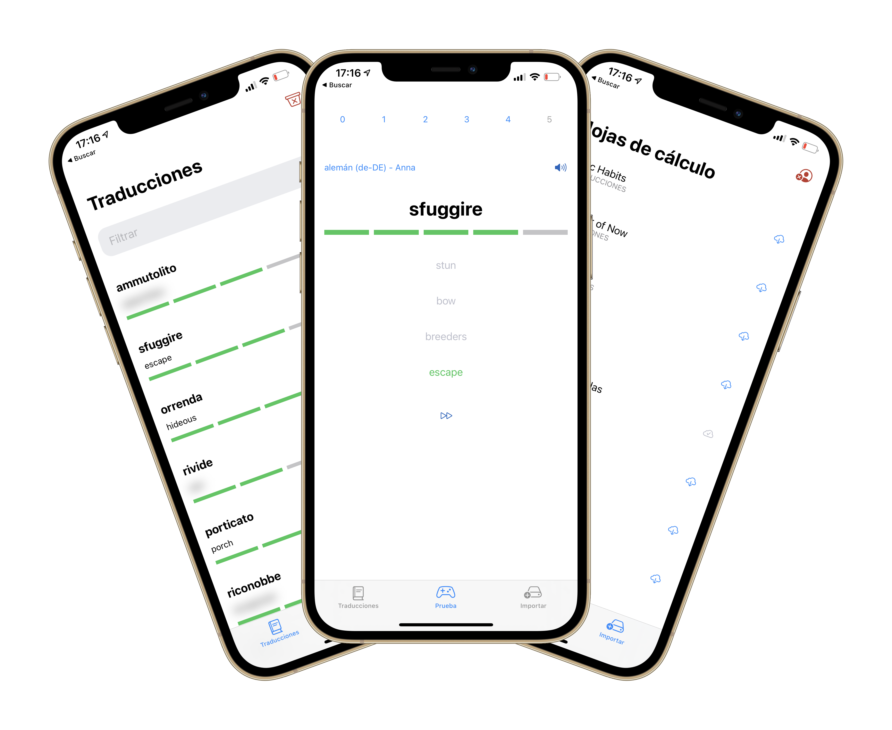
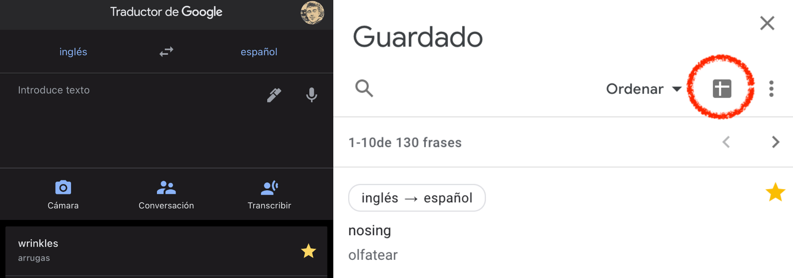

# MyVocabulary

When I read a book in a foreign language, I use Google Translate to help me understand my vocabulary. I built an app to import my favorite translations and help me learn them.

If I want to save some words from Google Translate, I mark them as favorites, pressing the star button for each word.

This is very useful because if I go to [https://translate.google.es/](https://translate.google.es/) and sign in with the same account, I can export that words into an XLSX file that will be stored automatically in my Google Drive.

I'll use this app as a playground to try and learn more about iOS, and I'll write some [articles](https://serg-ios.github.io/2021-03-06-my-vocabulary/) about it.

### [First steps 🐣](https://serg-ios.github.io/2021-03-07-my-vocabulary-first-steps/)

How to create a SwiftUI project with UIKit App Delegate life cycle? 

### [Google Cloud Platform ☁️](https://serg-ios.github.io/2021-03-08-my-vocabulary-google-cloud/)

How to obtain an API key?

### [URL Types configuration 🔗](https://serg-ios.github.io/2021-03-09-my-vocabulary-url-types/)

To store the Google API key.

### [Google Sign In, SwiftUI implementation 👤](https://serg-ios.github.io/2021-03-10-my-vocabulary-google-signin/)

To download Google Drive spreadsheets.

### [Don't upload API Keys to Git 🔐](https://serg-ios.github.io/2021-03-11-my-vocabulary-api-keys/)

Or any other sensitive data.

### [Fetch spreadsheets 📄](https://serg-ios.github.io/2021-03-12-my-vocabulary-fetch-spreadsheets/)

Using Google Drive API.

### [Parse spreadsheets 🔎](https://serg-ios.github.io/2021-03-13-my-vocabulary-parse-spreadsheets/)

Using CoreXLSX.

### [MVVM in SwiftUI 🗂](https://serg-ios.github.io/2021-03-14-my-vocabulary-mvvm-swiftui/)

Is a good pattern in SwiftUI?

### [Core Data in background ⏳](https://serg-ios.github.io/2021-03-15-my-vocabulary-background-corerdata/)

Storing thousands of objects requires time...

### [Background and concurrency in SwiftUI 🧵](https://serg-ios.github.io/2021-03-16-my-vocabulary-background-swiftui/)

How to handle concurrent tasks?

### [Dynamic Type 💤](https://serg-ios.github.io/2021-03-17-my-vocabulary-dynamictype/)

Make text bigger (or smaller).

### [VoiceOver 🗣](https://serg-ios.github.io/2021-03-18-my-vocabulary-voiceover/)

Read screen aloud.

### [Haptics 📳](https://serg-ios.github.io/2021-03-19-my-vocabulary-haptics/)

Default vs customizable vibrations.

### [Internationalization and Localization 🌍](https://serg-ios.github.io/2021-03-20-my-vocabulary-localization/)

Are the same?

### [Spotlight 📱](https://serg-ios.github.io/2021-03-21-my-vocabulary-spotlight/)

How to create shortcuts to the app in the Spotlight menu?

### [Widget 🔨](https://serg-ios.github.io/2021-03-22-my-vocabulary-widget/)

How to create a widget for the home screen?

### [Widget Bundles 🧰](https://serg-ios.github.io/2021-03-23-my-vocabulary-widget-bundle/)

How to create more than one kind of bundle?

### [Quick Actions ⚡️](https://serg-ios.github.io/2021-03-24-my-vocabulary-quick-action/)

How to register quick actions?

### [Open the app 🎯](https://serg-ios.github.io/2021-03-25-my-vocabulary-open-the-app/)

With UIApplicationShortcutItem and NSUserActivity.

### [Siri shortcuts 🩳](https://serg-ios.github.io/2021-03-26-my-vocabulary-siri-shortcuts/)

How to register a shortcut?

### [Reading text in screen 💬](https://serg-ios.github.io/2021-03-27-my-vocabulary-speech-synthesis/)

Using AVSpeechSynthesisVoice.
